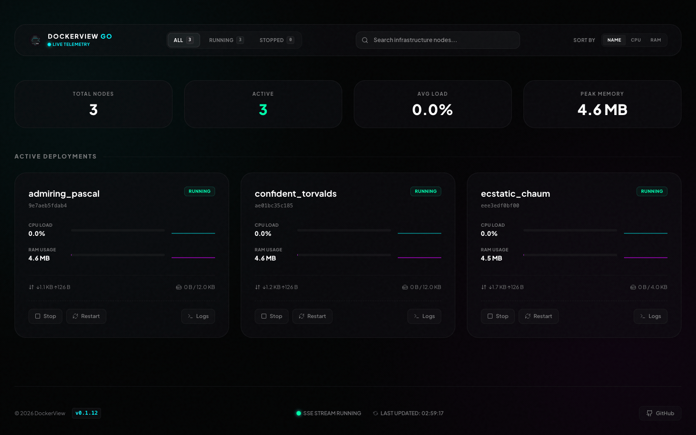

# DockerView-Go

一款基于 Go 和 bubbletea 构建的精美终端 Docker 容器监控工具，配备华丽的实时 Web 仪表盘。

[English](README.md) | 中文

## 演示



## 功能特性

- **实时监控**：每秒刷新数据
- **精美终端界面**：基于 [bubbletea](https://github.com/charmbracelet/bubbletea) 和 [lipgloss](https://github.com/charmbracelet/lipgloss) 构建，支持容器启停、重启和日志查看
- **实时 Web 仪表盘**：通过 `-server` 参数启用 HTTP 服务器，使用 SSE 实时推送容器数据，提供玻璃拟态风格的 Web 控制台，支持 SVG 迷你图、状态过滤、搜索高亮和 3D 悬停效果
- **Web 容器操控**：直接在 Web 仪表盘中启动、停止、重启容器（仅显示当前会话中通过 dockerview 停止的容器，保持界面整洁）
- **容器健康度评分**：根据 CPU 负载、内存占用、磁盘 I/O 速率、网络吞吐率、重启次数及运行时间动态计算 0-100 的健康度得分，并在顶部展示分组监控面板（健康、警告、危险容器数量），配有霓虹状态灯呼吸效果
- **日志查看器**：在终端或功能强大的 Web 模态框中查看容器日志，支持大小写无关的关键字搜索、日志等级过滤（ALL, DEBUG, INFO, WARN, ERROR）、自定义行数限制、搜索词高亮标色、自动滚动和一键下载日志文件
- **Token 安全认证**：控制 API 和日志接口受 Token 保护，自动生成安全密钥，支持访客只读模式，Token 存储于 localStorage
- **状态颜色标识**：运行中为绿色，已停止/退出为红色
- **CPU 告警**：CPU 使用率超过 50% 时红色高亮
- **自动检测**：自动检测 Docker Socket（支持 Unix Socket、WSL、Colima、OrbStack、Podman、Rancher Desktop 等）

## 环境要求

- Go 1.24+
- Docker 守护进程运行中
- 支持真彩色的终端（推荐）

## 安装

### 使用 `go install`

```bash
go install github.com/zsuroy/dockerview-go/cmd/dockerview@latest
```

确保 `$GOPATH/bin`（或 `$HOME/go/bin`）已加入 `PATH`。

### 从源码构建

```bash
git clone https://github.com/zsuroy/dockerview-go.git
cd dockerview-go
make build
./build/dockerview
```

### 快速运行

```bash
go run ./cmd/dockerview/
```

## 使用方法

```bash
./dockerview
```

### 终端快捷键

| 按键        | 操作     |
| ----------- | -------- |
| `↑` `↓`     | 选择容器 |
| `Enter`     | 显示操作 |
| `s`         | 启动容器 |
| `x`         | 停止容器 |
| `r`         | 重启容器 |
| `l`         | 查看日志 |
| `q` / `Esc` | 返回/退出 |
| `Ctrl+C`    | 退出程序 |

### Web 仪表盘与服务器模式

启用 HTTP 服务器后，可通过浏览器访问实时 Web 仪表盘：

```bash
# 默认端口 8080
./build/dockerview -server

# 自定义端口
./build/dockerview -server -port 8023

# 设置自定义安全 Token
./build/dockerview -server -token my-secret-token
```

启动后在浏览器中访问 `http://localhost:8080`（或自定义端口）即可打开交互式 Web 控制台。

#### 安全与访客模式

- **访客视图（只读）**：任何人无需 Token 即可查看实时监控数据（CPU/内存、网络、磁盘 I/O）
- **认证操控（管理员）**：启停重启容器和查看日志需要安全 Token
- **Token 管理**：
  - 未通过 `-token` 参数或 `DOCKERVIEW_TOKEN` 环境变量指定 Token 时，启动时自动生成 16 字节随机十六进制 Token 并打印到控制台
  - 首次点击管理操作或日志时，弹出安全输入框，输入后 Token 保存至浏览器 `localStorage`
  - 通过自动生成的 URL `http://localhost:8080/?token=<token>` 访问可自动认证并清理地址栏参数

### Docker Socket

DockerView-Go 自动检测 Docker Socket：

- 标准 Docker Socket（`/var/run/docker.sock`）
- Colima（`~/.colima/default/docker.sock`）
- 通过 `DOCKER_HOST` 环境变量指定自定义 Socket

```bash
DOCKER_HOST=unix:///path/to/docker.sock ./dockerview
```

## 构建命令

```bash
make build      # 构建到 ./build/dockerview
make install    # 安装到 $GOPATH/bin
make test       # 运行测试
make fmt        # 格式化代码
make vet        # 运行 go vet
make deps       # 下载并整理依赖
make release    # 跨平台构建（macOS、Linux、Windows）
make run        # 构建并运行
make clean      # 清理构建目录
```

## 项目结构

```txt
dockerview-go/
├── cmd/dockerview/           # 主应用程序
│   ├── main.go               # 入口
│   ├── model.go              # TUI 模型
│   ├── update.go             # 自动更新
│   ├── utils.go              # 工具函数
│   └── version.go            # 版本信息
├── internal/docker/          # Docker 客户端
│   ├── client.go             # Docker API 封装
│   └── client_test.go        # 测试
├── internal/server/          # HTTP & SSE 服务器
│   ├── server.go             # 服务器逻辑与 API 端点
│   └── web/                  # 编译后的 React UI 资源（自动嵌入）
├── frontend/                 # React + TypeScript 前端应用
│   ├── src/                  # React 源码（App.tsx、index.css、main.tsx 等）
│   ├── index.html            # Vite 模板入口文件
│   ├── vite.config.ts        # Vite 构建配置（输出到 internal/server/web）
│   └── package.json          # Node 依赖，Tailwind v4 和 React
├── .github/                  # CI/CD
├── Makefile                  # 构建命令（构建 Go 时自动执行 build-ui）
├── go.mod/go.sum             # Go 模块
└── README.md                 # 本文件
```

## 许可证

MIT 许可证 - 详见 [LICENSE](LICENSE) 文件

## 作者

[Suroy](https://suroy.cn)
